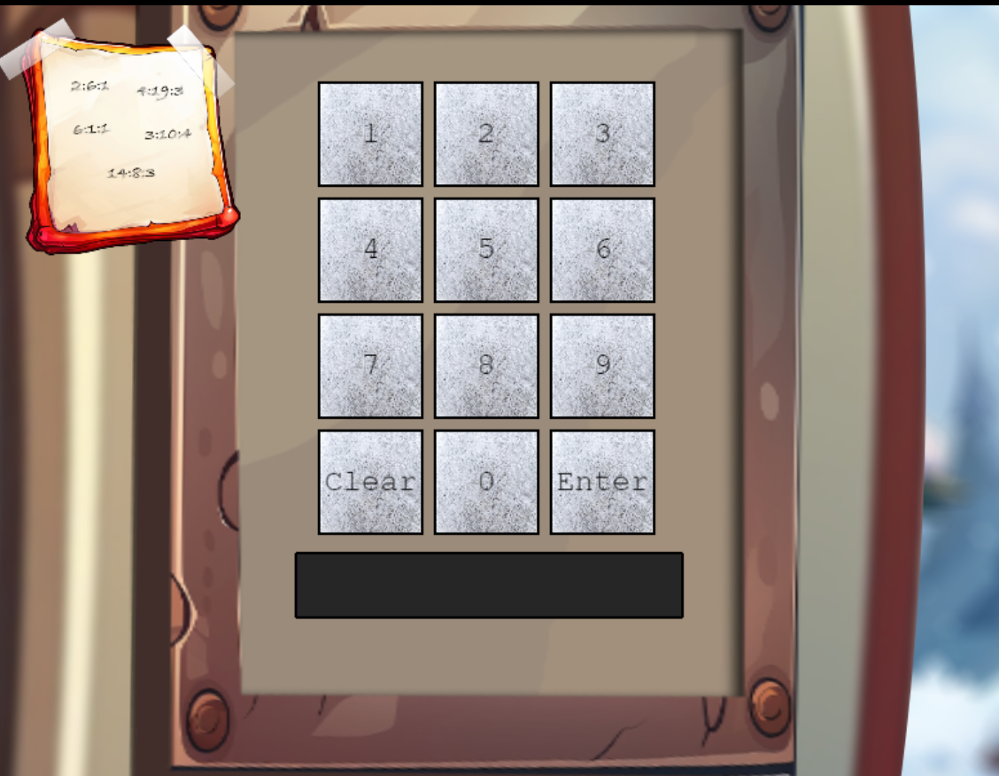
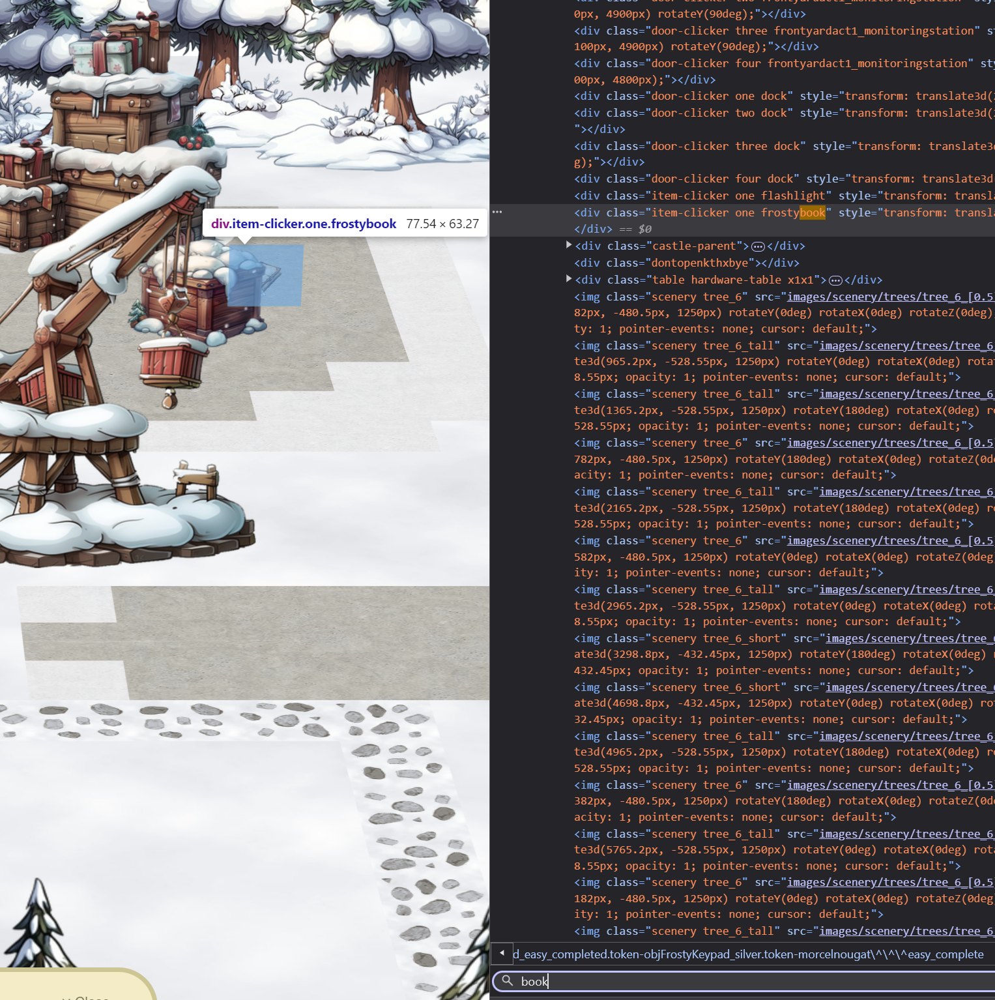
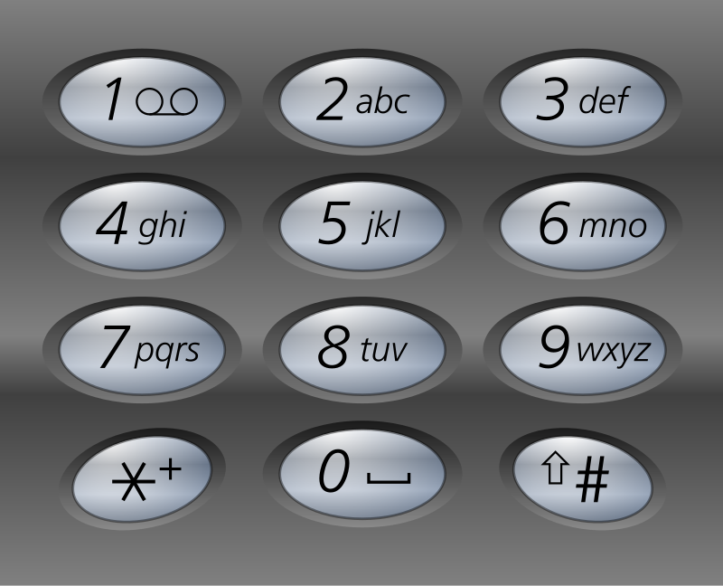
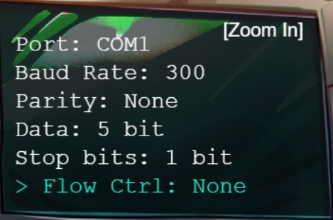
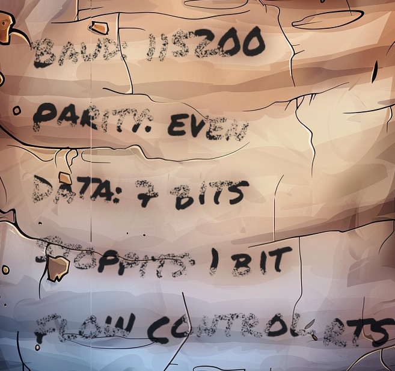
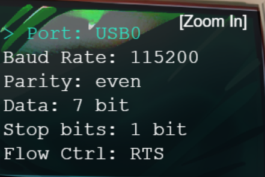
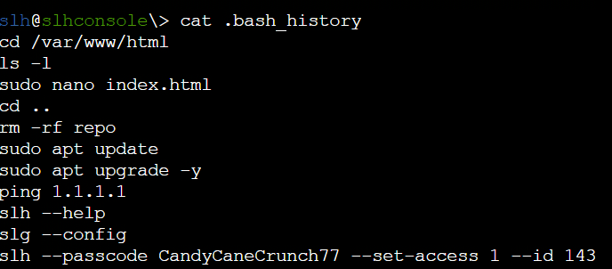
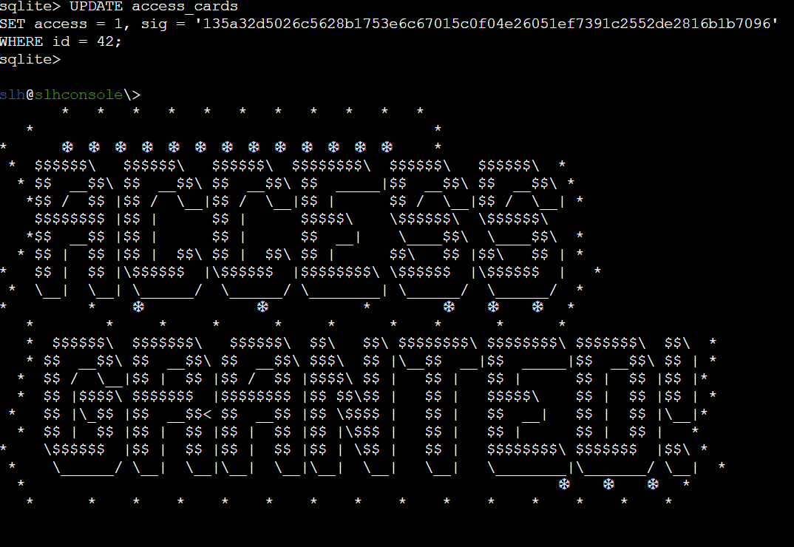

# Act 1

## Curling fun
This challenge was an introduction to using curl, which I am luckily very familiar with.

1) Unlike the defined standards of a curling sheet, embedded devices often have web servers on non-standard ports.  Use curl to retrieve the web page on host "curlingfun" port 8080.
If you need help, run the 'hint' command.

`curl curlingfun:8080`

2) Embedded devices often use self-signed certificates, where your browser will not trust the certificate presented.  Use curl to retrieve the TLS-protected web page at https://curlingfun:9090/

`curl -k https://curlingfun:9090`

3) Working with APIs and embedded devices often requires making HTTP POST requests. Use curl to send a request to https://curlingfun:9090/ with the parameter "skip" set to the value "alabaster", declaring Alabaster as the team captain.

`curl -k -X POST https://curlingfun:9090 -d "skip=alabaster"`

4) Working with APIs and embedded devices often requires maintaining session state by passing a cookie.  Use curl to send a request to https://curlingfun:9090/ with a cookie called "end" with the value "3", indicating we're on the third end of the curling match.

`curl -k -X POST https://curlingfun:9090 -b "end=3"`

5) Working with APIs and embedded devices sometimes requires working with raw HTTP headers.  Use curl to view the HTTP headers returned by a request to https://curlingfun:9090/

`curl -k -i https://curlingfun:9090`

6) Working with APIs and embedded devices sometimes requires working with custom HTTP headers.  Use curl to send a request to https://curlingfun:9090/ with an HTTP header called "Stone" and the value "Granite".

`curl -k -X POST https://curlingfun:9090 -H "Stone:Granite"`

7) curl will modify your URL unless you tell it not to.  For example, use curl to retrieve the following URL containing special characters: https://curlingfun:9090/../../etc/hacks

`curl -k --path-as-is https://curlingfun:9090/../../etc/hacks`

### Three command solution


After finishing the challenge, Bow Ninecandle says it can be solved using just three commands. This isn't too hard, as some commands can be combined into one. But for some reason, this didn't work. After a while, I realized that I am actually in a terminal, I can use other commands.

```sh
alabaster@curlingfun:~$ ls
HARD-MODE.txt  HELP
alabaster@curlingfun:~$ cat HARD-MODE.txt 
Prefer to skip ahead without guidance?  Use curl to craft a request meeting these requirements:

- HTTP POST request to https://curlingfun:9090/
- Parameter "skip" set to "bow"
- Cookie "end" set to "10"
- Header "Hack" set to "12ft"

alabaster@curlingfun:~$ cat HELP
Type the command hintme if you are in need of help during your journey.
You can also use the key combinations ( Ctrl+B ↑ or ↓ ) to resize the terminals.
```

There are different parameters. Let's try them.

```sh
Step 1:
curl curlingfun:8080

Step 2:
curl -k -X POST https://curlingfun:9090/ -d "skip=bow" -b "end=10"

Step 3:
curl -k -X POST https://curlingfun:9090/ -d "skip=bow" -b "end=10" -H "Hack: 12ft"

>> Excellent!  Now, use curl to access this URL: https://curlingfun:9090/../../etc/button

Step 4:
curl -k --path-as-is https://curlingfun:9090/../../etc/button

>> Great!  Finally, use curl to access the page that this URL redirects to: https://curlingfun:9090/GoodSportsmanship

Step 5:
curl -k -L https://curlingfun:9090/GoodSportsmanship

>> Excellent work, you have solved hard mode!  You may close this terminal once HHC grants your achievement.

```
## Frosty Keypad


In this challenge, we were tasked with recovering a lost code for a keypad. In the top left corner, there is a note with a few numbers. The numbers look like some sort of book cipher, but I haven't found any books yet. This might be used later.

When looking at the console log, the following was shown:
```
Result: {"flashlight_found":false}
Flashlight is disabled
```

After digging through the code, I realized that we were looking for an UV-light. I enabled it using the following command:

```js
uvLight.setVisible(true);
```


This gave me an interactive UV-light that I could use to find the numbers used, which turned out to be: 2, 6, 7, 8, and Enter. From the code, I could see that the max length for the code was 5. This could mean that one of the numbers were used twice.

I didn't see any obvious way to find the code, so I went the lazy way and bruteforced it. Considering that there were a maximum of five numbers, the total number would only be 1024 (n^r). I used pyautogui to emulate a keyboard:

```python
import time
import pyautogui
from itertools import product

# The numbers found using UV
keys = ['2', '6', '7', '8']

# Generate all combinations of length 5 with repetition
all_combinations = list(product(keys, repeat=5))

time.sleep(2)  # Initial delay to focus on the target window

total_combinations = len(all_combinations)
print(f"Total combinations: {total_combinations}")

for index, combo in enumerate(all_combinations, start=1):
    combination = "".join(combo)
    print(f"Typing combination {index}/{total_combinations}: {combination}")
    
    for char in combination:
        pyautogui.typewrite(char)
        time.sleep(0.01)
    
    pyautogui.press('enter')
    time.sleep(1)

>> Typing combination 46/1024: 22786
```
I got it on the 46th attempt, which makes me think this was the intended solution. The script was fairly dumb, so it did not know when the answer was correct. I had to count the amount of errors from the browser console logs to find the correct number.

### The note
Earlier in the challenge, the characters spoke of a book. And considering that this note was a book cipher, or *Ottendorf* cipher, we would need to use this book. There was even a comment in the HTML telling us which cipher it was:

```html
<body style="height: 100%;">

    <!-- overlay of note about Ottendorf -->
    <div id="../images/image-overlay">
        
    </div>
```

To find the book I opened the developer console and searched for "book", which was highlighted on the map when I found it:



I received the book in [my inventory](https://frost-y-book.com/).

The ottendorf cipher is in the following format:

`page:word:letter`

The numbers were the following:

```
2:6:1
4:19:3
6:1:1
3:10:4
14:8:6
```

This decodes to: SANTA

Now I had to convert this to six numbers somehow. After thinking about it for a while I realized it was a phone cipher:



```
S = 7
A = 2
N = 6
T = 8
A = 2
```

### One Thousand Little Teeny Tiny Shredded Pieces of Paper

As a gift, I got the shredded paper, which is exactly 1000 images with 1px width. I also got a link to [a python script](https://gist.github.com/arnydo/5dc85343eca9b8eb98a0f157b9d4d719), which seems to be the one used to create the images.

Running the script gave me this image:


This image will be useful for the next task.


## Hardware 1

In this challenge we were tasked with connecting a debugging device. The task seems relatively simple, but requires a step from the previous task (unless you bruteforce it).

First, I had to connect the wires:


```
VCC (voltage) -> V
RX (receive)  -> T
TX (transmit) -> R
GND (ground)  -> G
```
Then, I lowered the voltage from 5v to 3v by clicking on the upper right corner of the UART-bridge.

After the wires were correctly plugged in, I started the device by clicking the green "P" button. The standard settings looked like this:


These settings have to be changed to the ones found in the paper I recovered.




### Complete without connecting


We can apparently complete this challenge without connecting the device. This challenge didn't have any inline javascript, so I decided to look for clues in the console logs. I decided to click on the line where it logged "Data true" to see if I found anything useful:


A few lines above it was the following code, where a line had been commented:

```js
 // Build the URL with the request ID as a query parameter
  // Word on the wire is that some resourceful elves managed to brute-force their way in through the v1 API.
  // We have since updated the API to v2 and v1 "should" be removed by now.
  // const url = new URL(`${window.location.protocol}//${window.location.hostname}:${window.location.port}/api/v1/complete`);
  const url = new URL(`${window.location.protocol}//${window.location.hostname}:${window.location.port}/api/v2/complete`);
  ```

  I simply uncommented the line, and commented the new one and clicked on the "S" button.


## Hardware 2
In this challenge, we were tasked changing the access of access card number 42, but in order to do this we needed the password.

When I entered the terminal, I decided to look at the bash history. This revealed the password immediately:



The password was `CandyCaneCrunch77`.

```sh
slh@slhconsole\> slh --passcode CandyCaneCrunch77 --set-access 1 --id 42


       *   *   *   *   *   *   *   *   *   *   *
   *                                             *
*      ❄  ❄  ❄  ❄  ❄  ❄  ❄  ❄  ❄  ❄  ❄  ❄  ❄     *
 *  $$$$$$\   $$$$$$\   $$$$$$\  $$$$$$$$\  $$$$$$\   $$$$$$\  * 
  * $$  __$$\ $$  __$$\ $$  __$$\ $$  _____|$$  __$$\ $$  __$$\ *
   *$$ /  $$ |$$ /  \__|$$ /  \__|$$ |      $$ /  \__|$$ /  \__| *
    $$$$$$$$ |$$ |      $$ |      $$$$$\    \$$$$$$\  \$$$$$$\   
   *$$  __$$ |$$ |      $$ |      $$  __|    \____$$\  \____$$\  *
  * $$ |  $$ |$$ |  $$\ $$ |  $$\ $$ |      $$\   $$ |$$\   $$ | *
*   $$ |  $$ |\$$$$$$  |\$$$$$$  |$$$$$$$$\ \$$$$$$  |\$$$$$$  |   *
 *  \__|  \__| \______/  \______/ \________| \______/  \______/  *
*         *    ❄             ❄           *        ❄    ❄    ❄   *
   *        *     *     *      *     *      *    *      *      *
   *  $$$$$$\  $$$$$$$\   $$$$$$\  $$\   $$\ $$$$$$$$\ $$$$$$$$\ $$$$$$$\  $$\  *
   * $$  __$$\ $$  __$$\ $$  __$$\ $$$\  $$ |\__$$  __|$$  _____|$$  __$$\ $$ | *
  *  $$ /  \__|$$ |  $$ |$$ /  $$ |$$$$\ $$ |   $$ |   $$ |      $$ |  $$ |$$ |*
  *  $$ |$$$$\ $$$$$$$  |$$$$$$$$ |$$ $$\$$ |   $$ |   $$$$$\    $$ |  $$ |$$ | *
 *   $$ |\_$$ |$$  __$$< $$  __$$ |$$ \$$$$ |   $$ |   $$  __|   $$ |  $$ |\__|*
  *  $$ |  $$ |$$ |  $$ |$$ |  $$ |$$ |\$$$ |   $$ |   $$ |      $$ |  $$ |   *
*    \$$$$$$  |$$ |  $$ |$$ |  $$ |$$ | \$$ |   $$ |   $$$$$$$$\ $$$$$$$  |$$\ *
 *    \______/ \__|  \__|\__|  \__|\__|  \__|   \__|   \________|\_______/ \__|  *
  *                                                            ❄    ❄    ❄   *
   *      *    *    *    *    *    *    *    *    *    *    *    *    *    *                                                                                                                                        

Card 42 granted access level 1.
```
### Modifying database using HMAC


To get the gold medal, we had to use a different approach. This is what entry 42 looks like:

```sh
slh@slhconsole\> slh --view-card 42
Details of card with ID: 42
(42, 'c06018b6-5e80-4395-ab71-ae5124560189', 0, 'ecb9de15a057305e5887502d46d434c9394f5ed7ef1a51d2930ad786b02f6ffd')
```

The HMAC is the last element. By using `sqlite3`, I could see the secrets and format used for creating the entries:

```sh
slh@slhconsole\> sqlite3 access_cards 
SQLite version 3.40.1 2022-12-28 14:03:47
Enter ".help" for usage hints.
sqlite> .tables
access_cards  config      
sqlite> SELECT * FROM config;
1|hmac_secret|9ed1515819dec61fd361d5fdabb57f41ecce1a5fe1fe263b98c0d6943b9b232e
2|hmac_message_format|{access}{uuid}
3|admin_password|3a40ae3f3fd57b2a4513cca783609589dbe51ce5e69739a33141c5717c20c9c1
4|app_version|1.0
```

I found an [HMAC generator](https://www.freeformatter.com/hmac-generator.html) online in order to calculate the new entry. By using the format described in the config table, I used the following inputs:

String: `1c06018b6-5e80-4395-ab71-ae5124560189` ("1" prepended to the UUID from 42)\
Secret: `9ed1515819dec61fd361d5fdabb57f41ecce1a5fe1fe263b98c0d6943b9b232e` (from config table)\
Digest algorithm: `SHA-256` (default)

This computed the following hash: `135a32d5026c5628b1753e6c67015c0f04e26051ef7391c2552de2816b1b7096`

Finally, I changed the entry using `sqlite3`:

```sql
UPDATE access_cards
SET access = 1, sig = '135a32d5026c5628b1753e6c67015c0f04e26051ef7391c2552de2816b1b7096'
WHERE id = 42;
```

Exited using CTRL+D and got access.


